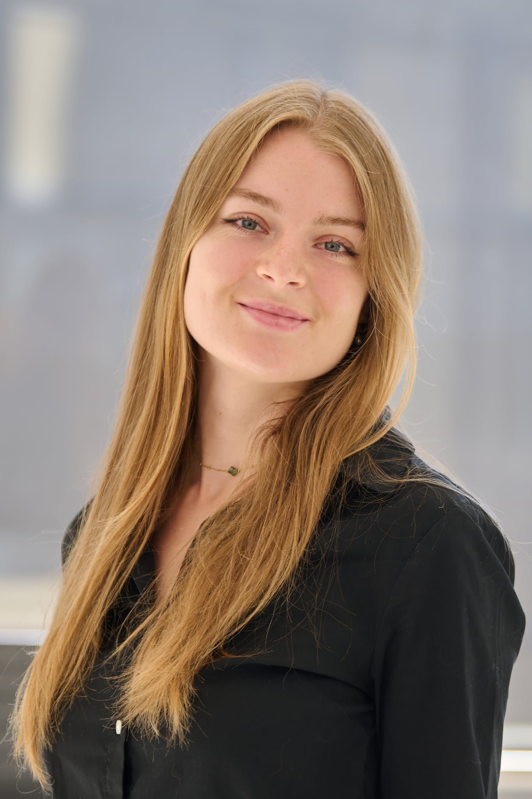
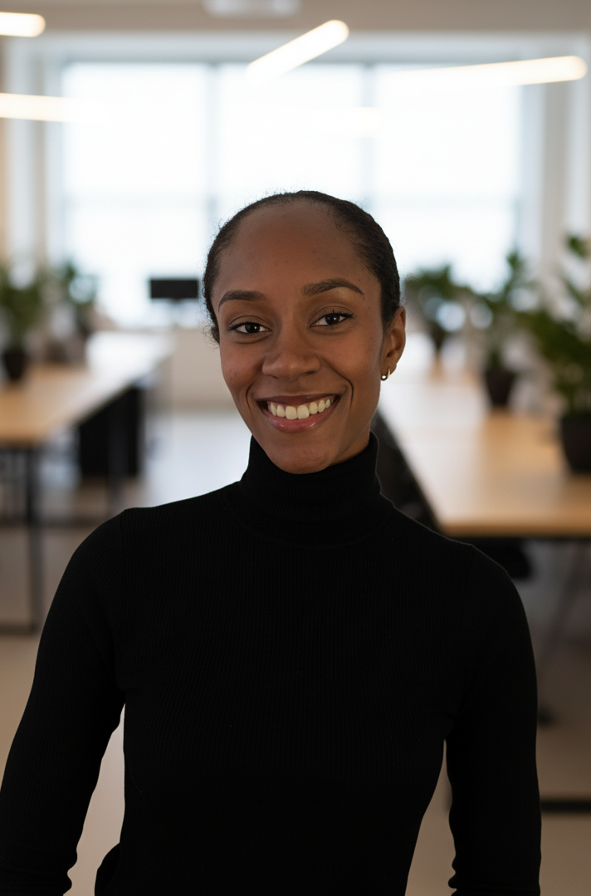

    <section class="section">
        <h2 class="section-title">Événements Scientifiques</h2>
        

            

                

                    
15 février 2025 • 19h00

                    <h3 class="event-title">Symposium de Recherche Translationnelle</h3>
                

                

                    
<strong>Lieu:</strong> Centre de recherche du CHUM

                    
Présentation des dernières avancées en recherche translationnelle avec des leaders d'opinion du milieu biomédical.

                

            

            
            

                

                    
28 février 2025 • 14h00

                    <h3 class="event-title">Forum Carrières en Biotechnologie</h3>
                

                

                    
<strong>Lieu:</strong> Pavillon Roger-Gaudry

                    
Table ronde avec des dirigeants de l'industrie pharmaceutique et biotechnologique canadienne.

                

            

            
            

                

                    
15 mars 2025 • 17h00

                    <h3 class="event-title">Congrès Étudiant de Recherche</h3>
                

                

                    
<strong>Lieu:</strong> Centre des sciences de la santé

                    
Présentation des travaux de recherche étudiants avec évaluation par jury d'experts.

                

            

        

    </section>

    <section class="section">
        <h2 class="section-title">Comité Exécutif</h2>
        

            

                
                
Jennifer Zevounou

                
Présidente

                
Doctorat en Sciences Biomédicales

                
Salut, je m'appelle Jennifer, je suis étudiante en deuxième année de doctorat en Sciences Biomédicales. Je conduis mes travaux de recherche à l'Institut de Cardiologie de Montréal dans le laboratoire du Dr Lettre où nous étudions les fonctions des variants génétiques associés aux maladies cardiovasculaires sur la fonction endothéliales. Dans mon temps libre, j'aime lire, jouer au tennis, et tout ce qui touche à l'art.

                <a href="https://www.linkedin.com/in/jennifer-zevounou-69321b237?utm_source=share&utm_campaign=share_via&utm_content=profile&utm_medium=android_app" class="linkedin-bubble" target="_blank">in</a>
            

            
            

                
                
Diarra B. Ba

                
Vice-Présidente

                
Doctorat en Sciences Biomédicales

                
Moi c’est Diarra Bocar Ba, doctorante en sciences biomédicales à l’Institut de cardiologie de Montréal, où je travaille sur l’insuffisance cardiaque. Curieuse et passionnée, j’aime voyager, découvrir de nouvelles cuisines, apprécier l’art ethnique et discuter des grands enjeux de société, notamment des dynamiques de genre. À mes heures perdues, j’aime écouter de la musique et m’adonner à des activités à sensations fortes.

                <a href="" class="linkedin-bubble" target="_blank">in</a>
            

            
            

                
                
Jade Laurent-Le Bras

                
Secrétaire

                
Maîtrise en Sciences Biomédicales

                
Je suis étudiante à la maîtrise en médecine expérimentale dans le laboratoire du Dr. Campeau au CHU Sainte-Justine. Ma recherche porte sur le développement d’une thérapie génique pour la maladie neurodégénérative de Sanfilippo. En dehors du laboratoire, je suis soit en train de peindre, courir ou de découvrir des nouveaux spots avec mes amis. Hâte de vous accueillir à nos prochains événements à l'AESBSCUM!

                <a href="[https://www.linkedin.com/in/bahareh-rasouli-4501b095?utm_source=share&utm_campaign=share_via&utm_content=profile&utm_medium=ios_app](https://www.linkedin.com/in/jade-laurent-le-bras-6395201b5/?originalSubdomain=ca)" class="linkedin-bubble" target="_blank">in</a>
            

            
            

                
                
Elisha Chacowry

                
Secrétaire

                
Maîtrise en Sciences Biomédicales

                
Etudiante en première année de maîtrise dans le laboratoire de Dr Pincez, au CHU Sainte Justine, j’étudie l’impact des déterminants génétiques de la mère sur les traits sanguins du nouveau-né ainsi que les effets sur sa santé- notamment les anomalies hématologiques. Nouvellement arrivée à Montréal j’apprécie découvrir la ville et ce qu’elle a offrir. Hormis cela, dans mon temps libre, j’aime beaucoup pâtisser et faire du sport.

                <a href="" class="linkedin-bubble" target="_blank">in</a>
            

            
            

                
                
Ali Reza Nemati

                
Trésorier et Responsable des résaeux sociaux

                
Doctorat en Sciences Biomédicales

                
Je suis doctorant à l'Université de Montréal, spécialisé en sciences biomédicales – médecine expérimentale. Mes recherches portent sur l'ingénierie tissulaire de l'œsophage, dans le but de créer un œsophage artificiel pour les patients atteints de troubles œsophagiens, tels que l'atrésie œsophagienne chez les nourrissons et le carcinome œsophagien chez les adultes.

                <a href="https://ca.linkedin.com/in/alireza-nemati-831868a9?trk=people-guest_people_search-card" class="linkedin-bubble" target="_blank">in</a>
            

            
        

    </section>

    <section class="section">
        <h2 class="section-title">Services Professionnels</h2>
        

            

                
R&D

                <h3>Support à la Recherche</h3>
                
Accompagnement dans les demandes de financement, méthodologie de recherche et collaboration inter-laboratoires.

            

            
            

                
NET

                <h3>Réseautage Scientifique</h3>
                
Mise en relation avec des chercheurs établis, mentors industriels et opportunités de collaboration internationale.

            

            
            

                
REP

                <h3>Représentation Institutionnelle</h3>
                
Défense des intérêts étudiants auprès des instances universitaires et organismes de financement.

            

            
            

                
DEV

                <h3>Développement Professionnel</h3>
                
Formations spécialisées, ateliers de rédaction scientifique et préparation aux carrières post-doctorales.

            

        

    </section>

<section class="contact-section">
    

        

            <h2 style="font-size: 2.5rem; margin-bottom: 1rem;">Rejoignez Notre Communauté Scientifique</h2>
            
Pour plus d'informations sur nos activités de recherche et opportunités de collaboration

            <a href="mailto:aesbcsum@gmail.com" class="contact-button">Contactez-Nous</a>
            
            

                <a href="https://www.instagram.com/aesbcs_um/" class="social-icon instagram" target="_blank" title="Suivez-nous sur Instagram">
                    📷
                </a>
                <a href="https://www.facebook.com/groups/1198446220269793/" class="social-icon facebook" target="_blank" title="Rejoignez-nous sur Facebook">
                    📘
                </a>
            

            
            

                
Association des Étudiants en Sciences Biomédicales aux Cycles Supérieurs

                
Université de Montréal • Faculté de Médecine

            

        

    

</section>
