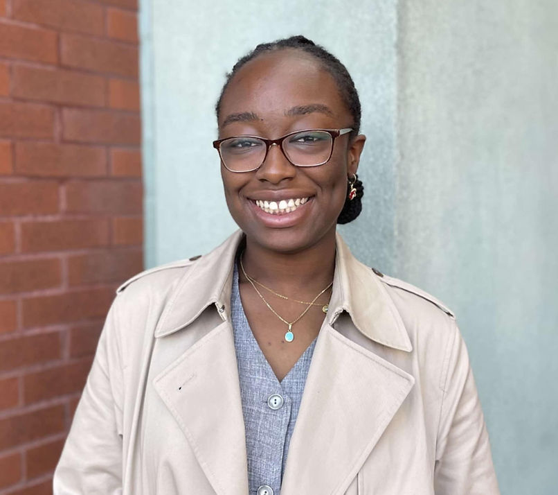

    <h2>🎯 Notre Mission</h2>
    
L'AESBCSUM, c'est votre association étudiante qui vous accompagne tout au long de votre parcours aux cycles supérieurs. On organise des événements, on vous aide avec vos démarches administratives, et on s'assure que votre voix soit entendue à l'université.

    <h2>📅 Événements à venir</h2>
    
    

        
15 février 2025 - 19h

        <h3>Soirée de networking</h3>
        
<strong>Lieu:</strong> Bar Le Sainte-Élisabeth 
        Venez rencontrer d'autres étudiants et des professionnels du domaine autour d'un verre!

    

    
    

        
28 février 2025 - 14h

        <h3>Conférence "Carrières en recherche"</h3>
        
<strong>Lieu:</strong> Pavillon Roger-Gaudry, local A-2345 
        Table ronde avec des diplômés maintenant en industrie et en académique.

    

    
    

        
15 mars 2025 - 17h

        <h3>5 à 7 de fin de session</h3>
        
<strong>Lieu:</strong> À confirmer 
        On se retrouve pour décompresser avant les examens!

    

    <h2>👥 Notre équipe</h2>
    
    

        

            
            <h3>Président·e</h3>
            
<strong>[Nom]</strong>

            
<em>Doctorat en [Programme]</em>

            
[Fun fact ou description]

        

        
        

            
            <h3>Vice-président·e</h3>
            
<strong>[Nom]</strong>

            
<em>Maîtrise en [Programme]</em>

            
[Fun fact ou description]

        

        
        

            
            <h3>Secrétaire-trésorier·ère</h3>
            
<strong>[Nom]</strong>

            
<em>Doctorat en [Programme]</em>

            
[Fun fact ou description]

        

        
        

            
            <h3>Communications</h3>
            
<strong>[Nom]</strong>

            
<em>Maîtrise en [Programme]</em>

            
[Fun fact ou description]

        

        
        

            
            <h3>Événements</h3>
            
<strong>[Nom]</strong>

            
<em>Doctorat en [Programme]</em>

            
[Fun fact ou description]

        

        
        

            
            <h3>Académique</h3>
            
<strong>[Nom]</strong>

            
<em>Maîtrise en [Programme]</em>

            
[Fun fact ou description]

        

    

    <h2>🚀 Ce qu'on fait pour vous</h2>
    <ul>
        <li><strong>Événements de réseautage</strong> entre étudiants et avec des professionnels</li>
        <li><strong>Support académique</strong> et aide avec les démarches administratives</li>
        <li><strong>Représentation étudiante</strong> auprès de l'administration universitaire</li>
        <li><strong>Intégration des nouveaux étudiants</strong> au début de chaque session</li>
        <li><strong>Activités sociales</strong> pour décompresser entre les labos et les cours</li>
    </ul>

    <h2>💬 Nous contacter</h2>
    
<strong>Email:</strong> <a href="mailto:aesbcsum@gmail.com">aesbcsum@gmail.com</a>

    
<strong>Réseaux sociaux:</strong> [Ajoutez vos liens]

     
    
<em>Envie de vous impliquer? Écrivez-nous!</em>

