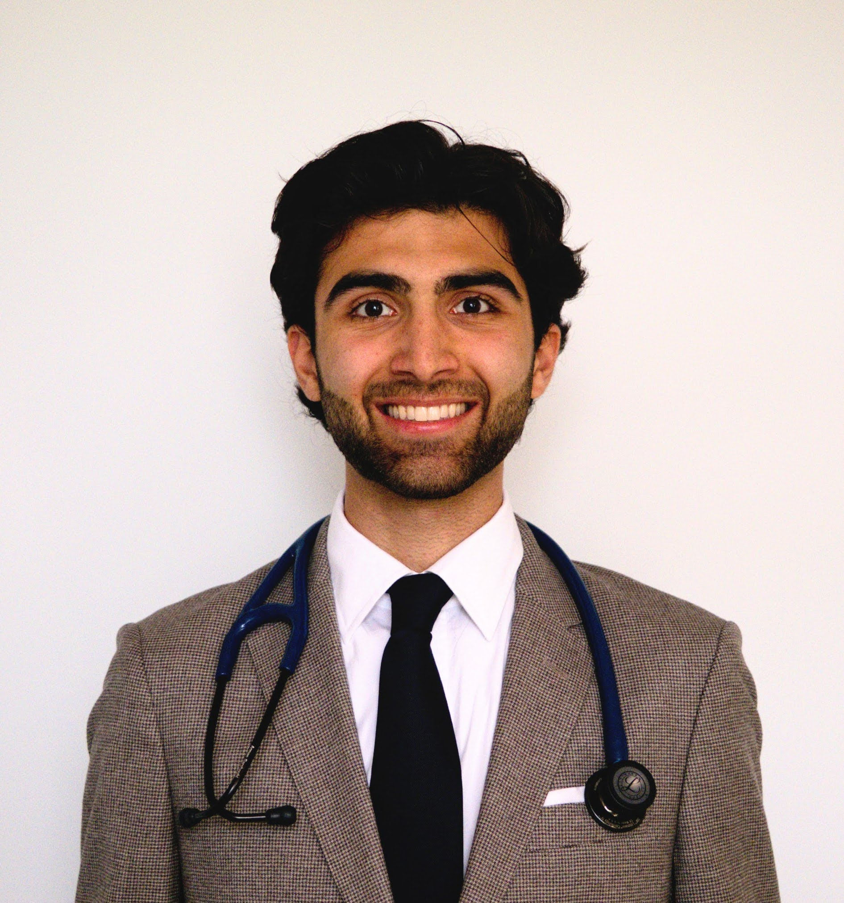
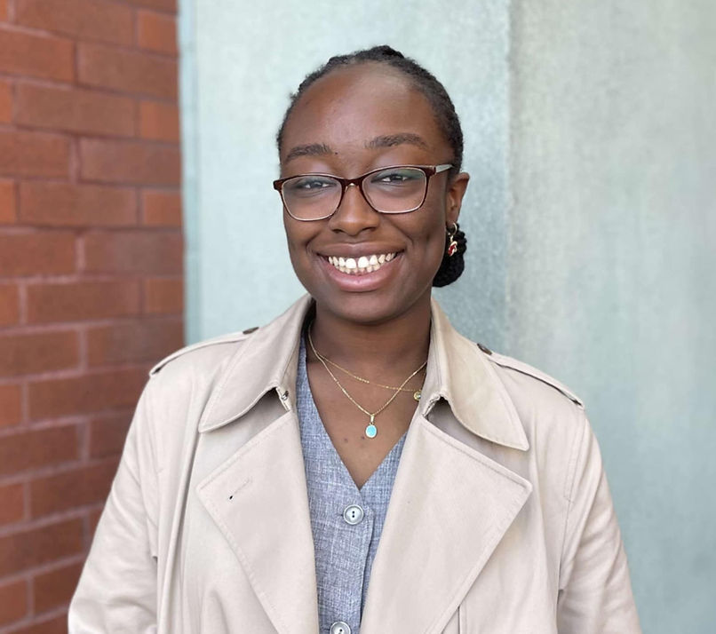
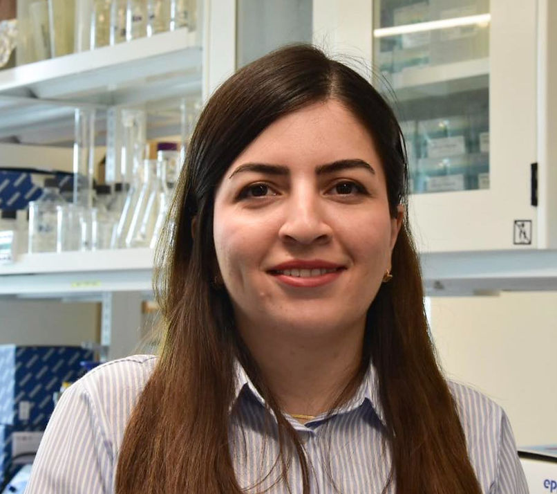
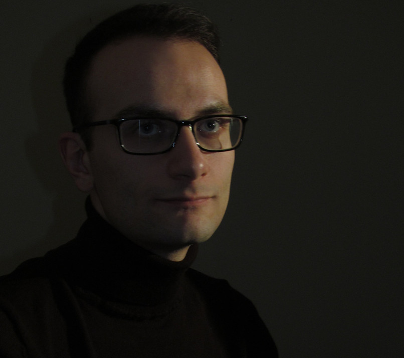
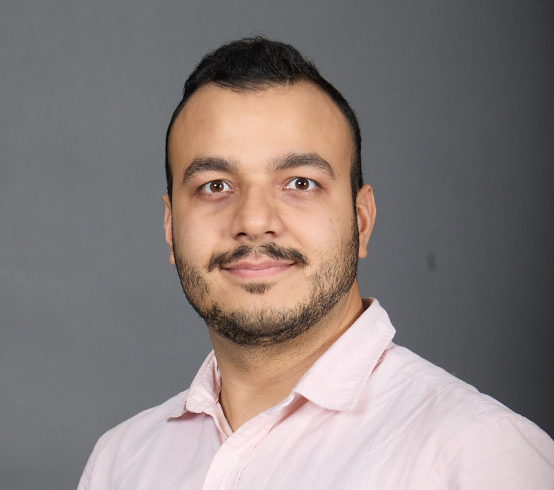

    <section class="section">
        <h2 class="section-title">Événements Scientifiques</h2>
        

            

                

                    
15 février 2025 • 19h00

                    <h3 class="event-title">Symposium de Recherche Translationnelle</h3>
                

                

                    
<strong>Lieu:</strong> Centre de recherche du CHUM

                    
Présentation des dernières avancées en recherche translationnelle avec des leaders d'opinion du milieu biomédical.

                

            

            
            

                

                    
28 février 2025 • 14h00

                    <h3 class="event-title">Forum Carrières en Biotechnologie</h3>
                

                

                    
<strong>Lieu:</strong> Pavillon Roger-Gaudry

                    
Table ronde avec des dirigeants de l'industrie pharmaceutique et biotechnologique canadienne.

                

            

            
            

                

                    
15 mars 2025 • 17h00

                    <h3 class="event-title">Congrès Étudiant de Recherche</h3>
                

                

                    
<strong>Lieu:</strong> Centre des sciences de la santé

                    
Présentation des travaux de recherche étudiants avec évaluation par jury d'experts.

                

            

        

    </section>

    <section class="section">
        <h2 class="section-title">Comité Exécutif</h2>
        

            

                
                
Arman Sarshoghi

                
Président

                
Maîtrise en Sciences Biomédicales

                
Je suis étudiant en médecine, et je suis dans la dernière année de ma maîtrise en médecine expérimentale. Je travaille au laboratoire du Dr. Liberman au CHUM - et j'explore les mécanismes cellulaires dans la cryoablation du cancer du poumon.

                <a href="https://linkedin.com/in/arman-sarshoghi" class="linkedin-bubble" target="_blank">in</a>
            

            
            

                
                
Jennifer Zevounou

                
Vice-Présidente

                
Doctorat en Sciences Biomédicales

                
Je suis étudiante en première année de doctorat dans le laboratoire du Dr Lettre à l'Institut de Cardiologie de Montréal. Ma recherche porte sur l'étude des variants génétiques associés aux maladies cardiovasculaires. Dans mon temps libre j'aime lire, jouer au tennis et sortir avec mes amis !

                <a href="https://linkedin.com/in/jennifer-zevounou" class="linkedin-bubble" target="_blank">in</a>
            

            
            

                
                
Baharehsadat Rasouli

                
Responsable des communications

                
Maîtrise en Sciences Biomédicales

                
Baharehsadat Rasouli, la responsable de la communication pour l'AESBSUM. En tant qu'étudiant de première année de maîtrise dans le laboratoire du Professeur Benjamin Haley au Centre de recherche de l'Hôpital Maisonneuve-Rosemont, j'étudie les voies de régulation des miARN en utilisant le génie génétique et la génomique fonctionnelle. Lorsque je ne suis pas au laboratoire, j'aime lire, faire de l'exercice, et passer du temps avec mes amis.

                <a href="https://linkedin.com/in/baharehsadat-rasouli" class="linkedin-bubble" target="_blank">in</a>
            

            
            

                
                
Simon Lemyre

                
Trésorier

                
Doctorat en Sciences Biomédicales

                
Je suis étudiant au doctorat en sciences biomédicales, option éthique clinique. Mes recherches portent sur la réduction de la souffrance existentielle et systémique des personnes demandant l'aide médicale à mourir. Je suis impliqué dans des projets de recherches interdisciplinaires, notamment dans le CIRAMM. Je valorise l'engagement étudiant, le dialogue inclusif et le développement d'initiatives novatrices. En dehors de mes études, je pratique l'improvisation théâtrale et je m'implique comme bénévole à la ligne d'écoute d'Interligne.

                <a href="https://linkedin.com/in/simon-lemyre" class="linkedin-bubble" target="_blank">in</a>
            

            
            

                
                
Ali Reza Nemati

                
Secrétaire

                
Doctorat en Sciences Biomédicales

                
Je suis doctorant à l'Université de Montréal, spécialisé en sciences biomédicales – médecine expérimentale. Mes recherches portent sur l'ingénierie tissulaire de l'œsophage, dans le but de créer un œsophage artificiel pour les patients atteints de troubles œsophagiens, tels que l'atrésie œsophagienne chez les nourrissons et le carcinome œsophagien chez les adultes.

                <a href="https://linkedin.com/in/alireza-nemati" class="linkedin-bubble" target="_blank">in</a>
            

            
            

                
                
John Mirvens Medor

                
Responsable des réseaux sociaux

                
Maîtrise en Sciences Biomédicales

                
Je suis médecin diplômé hors Canada et actuellement étudiant en Sciences biomédicales à option sciences cardiovasculaires. Je travaille avec mon directeur de recherche Dr Brian Potter au CRCHUM sur l'approche novatrice en choc cardiogénique: du fondamentale à la science d'implantation.

                <a href="https://linkedin.com/in/john-medor" class="linkedin-bubble" target="_blank">in</a>
            

        

    </section>

    <section class="section">
        <h2 class="section-title">Services Professionnels</h2>
        

            

                
R&D

                <h3>Support à la Recherche</h3>
                
Accompagnement dans les demandes de financement, méthodologie de recherche et collaboration inter-laboratoires.

            

            
            

                
NET

                <h3>Réseautage Scientifique</h3>
                
Mise en relation avec des chercheurs établis, mentors industriels et opportunités de collaboration internationale.

            

            
            

                
REP

                <h3>Représentation Institutionnelle</h3>
                
Défense des intérêts étudiants auprès des instances universitaires et organismes de financement.

            

            
            

                
DEV

                <h3>Développement Professionnel</h3>
                
Formations spécialisées, ateliers de rédaction scientifique et préparation aux carrières post-doctorales.

            

        

    </section>

<section class="contact-section">
    

        

            <h2 style="font-size: 2.5rem; margin-bottom: 1rem;">Rejoignez Notre Communauté Scientifique</h2>
            
Pour plus d'informations sur nos activités de recherche et opportunités de collaboration

            <a href="mailto:aesbcsum@gmail.com" class="contact-button">Contactez-Nous</a>
            
            

                <a href="https://instagram.com/aesbcsum" class="social-icon instagram" target="_blank" title="Suivez-nous sur Instagram">
                    📷
                </a>
                <a href="https://facebook.com/aesbcsum" class="social-icon facebook" target="_blank" title="Rejoignez-nous sur Facebook">
                    📘
                </a>
            

            
            

                
Association des Étudiants en Sciences Biomédicales aux Cycles Supérieurs

                
Université de Montréal • Faculté de Médecine

            

        

    

</section>
